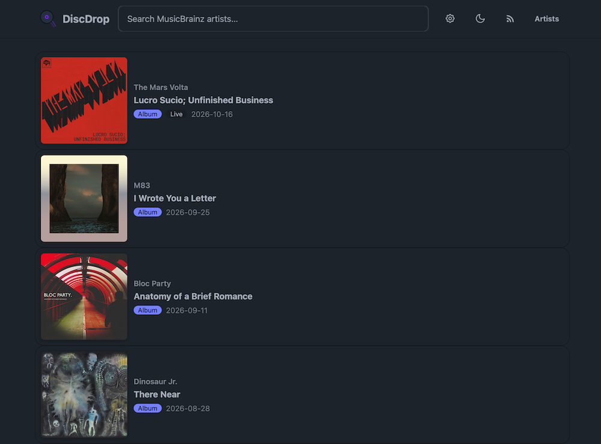

# DiscDrop 💿

Drop the needle on every new release from the artists you follow. DiscDrop tracks MusicBrainz **release groups** and presents them as a combined web feed plus RSS.

Built with Java 21 + Quarkus, htmx, and daisyUI.

### Feed view


## Features

### 🔍 Search & follow
Search MusicBrainz by artist name with autocomplete — see disambiguation and area at a glance. Follow any artist with one click; the feed updates immediately via htmx without a full page reload.

### 📡 Combined feed
Every release group from every followed artist, sorted by first-release date. Cover art is fetched lazily from the Cover Art Archive — no extra API calls during sync. Load more pagination keeps the page snappy.

Each row shows cover art thumbnail, artist name, release title, type badges (album / single / EP / …), and release date with an external link to MusicBrainz.

### 🎚️ Per-artist type toggles
Control which release types appear in your feed per artist — toggle `album`, `single`, `ep`, `broadcast`, and `other` independently. Changes trigger a re-sync and refresh the feed in-place.

### ⏱️ Scheduled sync
A background job refreshes release groups on a configurable schedule (6 / 12 / 24 hours). Follow a new artist and it syncs immediately, so the feed populates without waiting.

### 📰 RSS feed
A global RSS 2.0 feed with Media RSS cover art — subscribe from your reader of choice. Discoverable via `<link rel="alternate">` from the app root.

### 🌗 Theme switching
Built-in light/dark theme toggle, persisted in `localStorage`.

## Quick Start

### With Docker Compose (easiest)

```bash
# 1. Configure your MusicBrainz User-Agent
cp .env.example .env
# Edit .env with your contact email

# 2. Start
docker compose up -d
```

Open http://localhost:8080 — RSS at http://localhost:8080/rss

### With Docker

```bash
docker run -p 8080:8080 \
  -v $(pwd)/data:/app/data \
  -e MBZ_USER_AGENT="DiscDrop/1.0 (your.email@example.com)" \
  droideparanoico/discdrop
```

> **`MBZ_USER_AGENT` is required.** MusicBrainz blocks clients without a meaningful `User-Agent`. Set it to your contact email.

### Development

```bash
# Terminal — Quarkus dev server
./mvnw quarkus:dev
```

Open http://localhost:8080

## Configuration

All settings are in `application.properties`. Key values can be overridden via environment variables:

| Property | Env var | Default | Notes |
|---|---|---|---|
| `discdrop.mbz.user-agent` | `MBZ_USER_AGENT` | *(required, no default)* | Contact string for MusicBrainz |
| `quarkus.rest-client."musicbrainz".url` | — | `https://musicbrainz.org/ws/2` | MBZ API base |
| `discdrop.mbz.rate-limit-ms` | — | `1000` | Gap between MBZ calls (≤1 req/s) |
| `discdrop.feed.page-size` | — | `25` | Feed page / load-more batch |
| `discdrop.rss.item-count` | — | `50` | RSS item count |
| `discdrop.sync.default-schedule-hours` | — | `24` | Default sync interval |
| `discdrop.sync.default-primary-types` | — | `album` | Default types for new artists |

The H2 file database lives in `./data/discdrop.mv.db`

## Architecture

- **Backend**: Quarkus (Java 21, JAX-RS, Hibernate ORM with Panache) — H2 file database, zero external services
- **Frontend**: Server-rendered Qute templates + htmx + daisyUI (Tailwind) — no SPA framework
- **MusicBrainz**: REST Client (MicroProfile) with rate-limited access, externalized `User-Agent`
- **Sync**: Quarkus Scheduler — configurable cadence, immediate sync on follow
- **RSS**: RSS 2.0 with Media RSS cover art, Qute XML template
- **Cover art**: Deterministic URLs from Cover Art Archive — fetched lazily by the browser, no extra sync overhead
